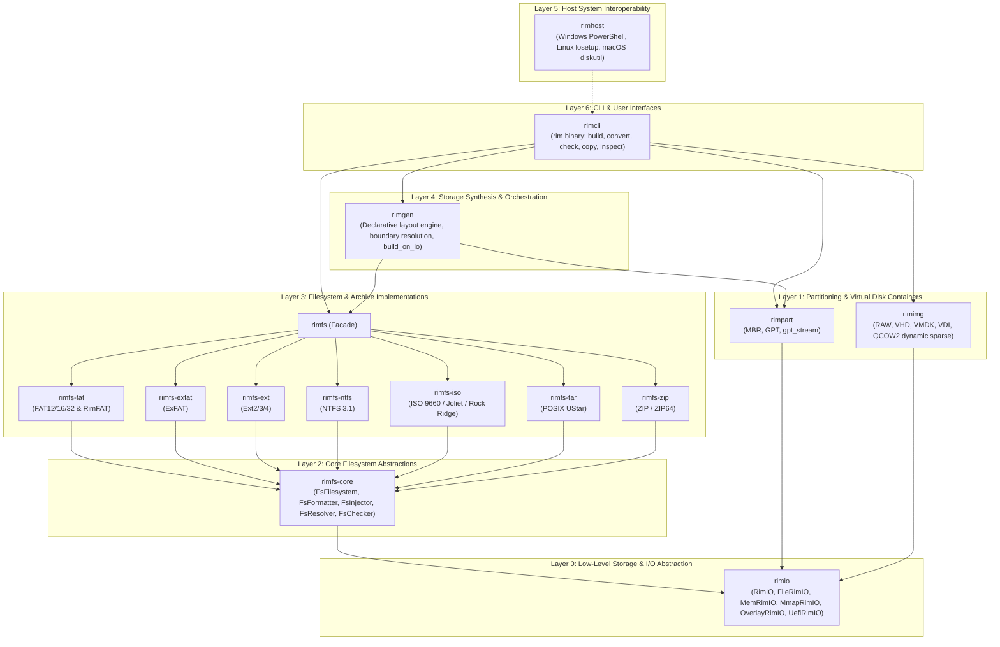
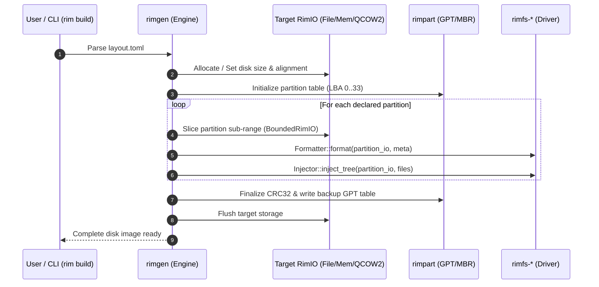
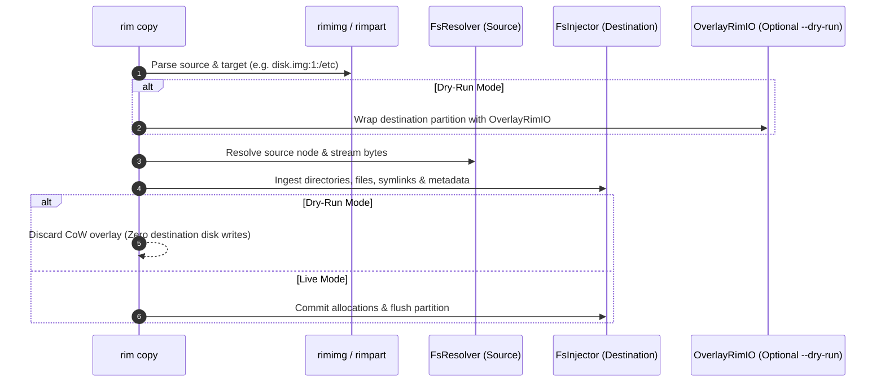
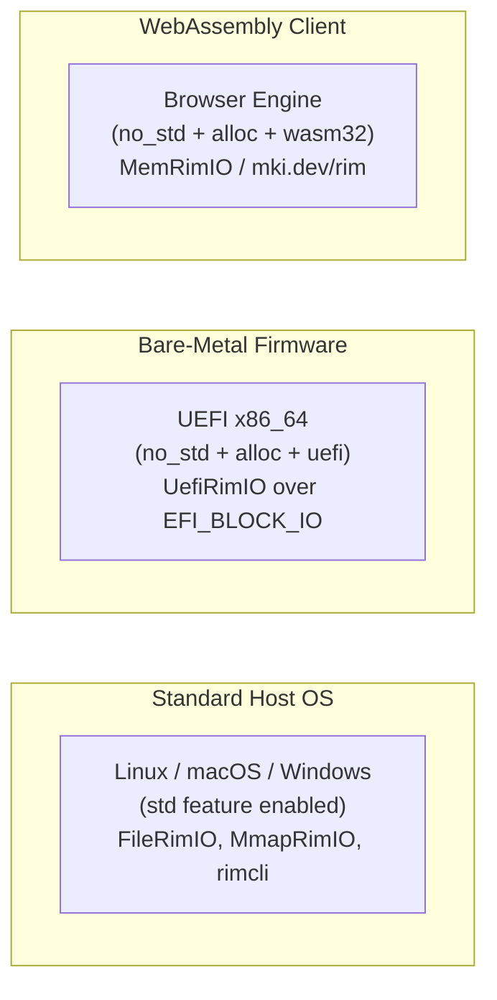

# RIM Architecture Overview

**RIM (Rust Image Maker)** is a modular, pure-Rust toolkit and engine designed for **generating, manipulating, converting, verifying, and analyzing disk images and filesystems**.

This document describes the high-level architecture, design philosophy, layered system decomposition, and runtime execution models across the 15 workspace crates.

---

## 1. Design Philosophy & Core Principles

RIM is built from first principles to address the limitations of legacy storage utilities (such as `losetup`, `e2fsprogs`, `ntfs-3g`, `mkisofs`, `xorriso`, and `qemu-img`):

- **100% Userspace & Rootless Execution**:
  RIM never requires root (`sudo`) privileges, kernel loopback devices (`/dev/loop*`), or OS mount points. All partition parsing, container decapsulation, and filesystem formatting/injection occur directly in userspace via random-access positioned I/O.
- **Zero External C Dependencies**:
  Every partition table (MBR, GPT), container format (RAW, VHD, VMDK, VDI, QCOW2), and filesystem driver (FAT12/16/32, RimFAT, ExFAT, EXT2/3/4, NTFS 3.1, ISO 9660, TAR, ZIP) is written in 100% pure, safe Rust. RIM compiles seamlessly on any platform without requiring external C toolchains or dynamic libraries.
- **Cross-Platform Determinism**:
  Identical layout specifications produce bit-for-bit or logically equivalent output regardless of whether RIM is executed on **Linux**, **macOS** (Apple Silicon or Intel), or **Windows**.
- **Positioned, Streaming I/O Model**:
  Storage operations are abstracted through [`RimIO`](../rimio/src/lib.rs), a random-access positioned I/O trait. This decouples storage logic from OS file descriptors and allows transparent execution over memory buffers, memory-mapped files, sparse page overlays, or bare-metal firmware.
- **Resource-Constrained & Bare-Metal Compatibility**:
  Core crates support `#![no_std]` and `alloc`-only execution. RIM can be compiled for native **UEFI firmware** (`x86_64-unknown-uefi`) and **WebAssembly** (`wasm32-unknown-unknown`), enabling in-browser disk generation at [mki.dev/rim](https://mki.dev/rim).

---

## 2. The 7-Layer Architecture

The RIM ecosystem is organized into seven decoupled, hierarchical layers:

### Layer Breakdown & Responsibilities

| Layer | Crates | Primary Responsibility |
|---|---|---|
| **Layer 0: Storage & I/O** | [`rimio`](../rimio) | Positioned zero-allocation I/O primitives, streaming, copy-on-write sparse overlays (`OverlayRimIO`), and environment backends (`std`, `mem`, `mmap`, `uefi`). |
| **Layer 1: Partitioning & Containers** | [`rimpart`](../rimpart), [`rimimg`](../rimimg) | MBR/GPT partition tables (including single-pass streaming GPT) and virtual machine disk container encap/decap (RAW, VHD, VMDK, VDI, QCOW2). |
| **Layer 2: Core FS Abstractions** | [`rimfs-core`](../rimfs-core) | Core traits defining filesystem lifecycles: `FsFilesystem`, `FsFormatter`, `FsInjector`, `FsResolver`, `FsChecker`, along with allocation bitmaps and path trackers. |
| **Layer 3: FS Implementations** | [`rimfs-*`](../rimfs), [`rimfs`](../rimfs) | Concrete drivers for 7 filesystem and archive formats, plus a unified facade with automatic format detection. |
| **Layer 4: Storage Synthesis** | [`rimgen`](../rimgen) | Declarative layout compiler parsing `layout.toml`, calculating partition boundaries/alignments, and orchestrating formatting and payload injection. |
| **Layer 5: Host Interop** | [`rimhost`](../rimhost) | Native platform command generation for fallback host-level tooling (PowerShell Storage, `losetup`, `diskutil`). |
| **Layer 6: Applications & CLI** | [`rimcli`](../rimcli) | Unified `rim` executable providing subcommands: `build`, `convert`, `check`, `inspect`, `partition`, and the universal rootless `copy` engine. |

---

## 3. High-Level Data Flows

### Synthesis Pipeline (`rim build`)

When synthesizing a disk image from a declarative specification:

### Universal Logical Transfer (`rim copy`)

When transferring files between host and disk image partitions without root privileges:

---

## 4. Runtime Profiles & Environment Targets

RIM is designed to execute seamlessly across three distinct target environments:

1. **Standard Host OS (`std`)**:
   Full CLI capabilities, positioned file I/O (`FileRimIO`), memory mapping (`MmapRimIO`), multi-threading, and native OS fallbacks.
2. **Embedded & UEFI Firmware (`no_std + alloc + uefi`)**:
   Runs inside pre-boot UEFI environments. `UefiRimIO` bridges `RimIO` calls directly to the UEFI firmware's `EFI_BLOCK_IO_PROTOCOL` to synthesize or verify boot partitions before the OS kernel boots.
3. **WebAssembly (`wasm32-unknown-unknown`)**:
   Runs 100% client-side in standard web browsers. Powers the interactive playground at [mki.dev/rim](https://mki.dev/rim) using in-memory virtual disks (`MemRimIO`).

---

## 5. Architectural Deep Dives

For exhaustive implementation details on each subsystem, consult the specialized architecture guides:

- **[Filesystem Engines & Contracts (`docs/FILESYSTEMS.md`)](FILESYSTEMS.md)**:
  Exhaustive specification of `rimfs-core` traits (`FsFilesystem`, `FsFormatter`, `FsInjector`, `FsResolver`, `FsChecker`) and internal architecture of the 7 filesystem and archive drivers (FAT/RimFAT, ExFAT, EXT2/3/4, NTFS 3.1, ISO 9660, TAR, ZIP).
- **[Containers, Partitions & Storage I/O (`docs/CONTAINERS.md`)](CONTAINERS.md)**:
  Technical details of the `RimIO` abstraction layer, `OverlayRimIO` copy-on-write engine, MBR/GPT and streaming partition tables (`rimpart`), and virtual machine disk container formats (`rimimg`: RAW, VHD, VMDK, VDI, QCOW2 dynamic sparse allocator).
- **[Synthesis & Transfer Engine (`docs/SYNTHESIS_AND_TRANSFER.md`)](SYNTHESIS_AND_TRANSFER.md)**:
  Declarative image synthesis with `rimgen`, partition alignment and auto-sizing algorithms, the universal rootless `rim copy` transfer engine, and `rimhost` platform integration.
