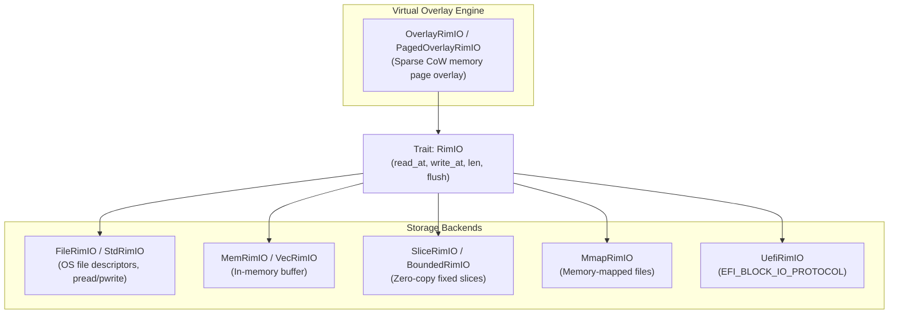
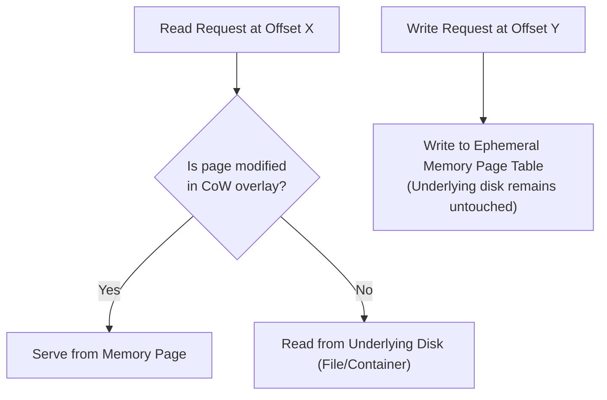
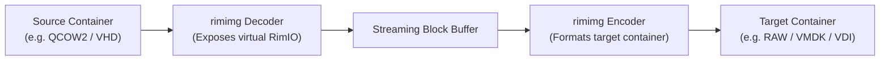

# Containers, Partitions & Storage I/O (`rimimg`, `rimpart`, `rimio`)

This document provides the architectural reference for storage virtualization, partition table management, and the positioned I/O subsystem in RIM.

---

## 1. Storage & I/O Abstraction Layer (`rimio`)

The foundation of RIM's storage engine is [`rimio`](../rimio), a zero-allocation, positioned random-access I/O layer designed to work seamlessly across `#![no_std]`, bare-metal firmware, and standard operating systems.



### The `RimIO` Trait Contract

Unlike standard `std::io::Read` and `std::io::Write`, which rely on implicit internal file cursors (`seek`), `RimIO` requires explicit byte offsets for all read and write operations:

```rust
pub trait RimIO {
    fn read_at(&mut self, offset: u64, buf: &mut [u8]) -> RimIOResult<usize>;
    fn write_at(&mut self, offset: u64, buf: &[u8]) -> RimIOResult<usize>;
    fn len(&mut self) -> RimIOResult<u64>;
    fn flush(&mut self) -> RimIOResult<()>;
}
```

This design guarantees:
- **Thread Safety & Concurrent Isolation**: Independent readers and writers operate without race conditions on shared seek cursors.
- **Partition Bounding**: [`BoundedRimIO`](../rimio/src/mem.rs) wraps any sub-range $[O, O + L)$ of a disk image, presenting it to filesystem formatters and injectors as an isolated, zero-indexed virtual disk.
- **Zero Kernel Overhead in Memory**: In-memory synthesis (`MemRimIO`) and slice operations (`SliceRimIO`) incur zero system call overhead.

### Copy-on-Write Sparse Overlays (`OverlayRimIO`)

[`OverlayRimIO`](../rimio/src/sparse.rs) and `PagedOverlayRimIO` provide a virtual storage layer that wraps any underlying read-only `RimIO` device with an ephemeral in-memory sparse page table:



- **Zero-Write `--dry-run`**: Enables `rim copy --dry-run` to execute complete filesystem allocations, directory tree injections, and metadata updates without modifying a single byte on the physical disk image.
- **Transactional Rollback**: Changes can be evaluated or discarded instantly by dropping the overlay structure.

---

## 2. Partitioning Systems (`rimpart`)

The [`rimpart`](../rimpart) crate manages partition tables, geometry alignments, and streaming partition synthesis.

### 2.1 MBR (Master Boot Record)
- Located at LBA 0 (sector 0).
- Contains a 446-byte bootstrap code area, four 16-byte partition records, and the validation signature `0x55AA`.
- Supports active/bootable flags and standard partition type IDs (`0x0C` FAT32 LBA, `0x83` Linux Native, `0x07` NTFS/ExFAT).
- Enforces 32-bit LBA sector limits ($\le 2$ TiB for 512-byte sectors).

### 2.2 GPT (GUID Partition Table)
Designed for modern UEFI systems and large disks ($>2$ TiB):

```
LBA 0:       Protective MBR (Single partition of type 0xEE spanning the disk)
LBA 1:       Primary GPT Header (Signature 'EFI PART', Header CRC32, Array CRC32)
LBA 2..33:   Partition Entry Array (128 entries of 128 bytes each)
LBA 34..N:   Usable Disk Sectors (Partitions 1..N)
LBA END-33:  Backup Partition Entry Array (Mirror of LBA 2..33)
LBA END:     Backup GPT Header (Mirror pointing to primary structures)
```

- **Partition Entry Structure (128 bytes)**:
  - Partition Type GUID (e.g. EFI System Partition `C12A7328-F81F-11D2-BA4B-00A0C93EC93B`).
  - Unique Partition GUID.
  - Starting LBA & Ending LBA (64-bit absolute sector numbers).
  - Attribute Flags (bit 0: System partition, bit 2: Legacy BIOS bootable, bit 60: Read-only).
  - Partition Name (36 characters encoded in UTF-16LE).

### 2.3 Streaming GPT (`gpt_stream`)

Traditional GPT generation requires random-access seeking between LBA 1 (Primary Header), LBA 2..33 (Partition Array), and the end of the disk (Backup Header/Array). 

`rimpart` introduces **`gpt_stream`**, a streaming partition engine that:
1. Emits the protective MBR and primary header placeholder sequentially.
2. Computes the partition array CRC32 dynamically on-the-fly as partition entries are emitted.
3. Updates headers and writes the secondary GPT structures without requiring full-disk in-memory buffering.

---

## 3. Virtual Machine Disk Containers (`rimimg`)

The [`rimimg`](../rimimg) crate provides detection, decapsulation, encapsulation, and conversion across five virtual disk formats:

```
rimimg/
├── RAW   (.img, .raw)   - Flat 1:1 sector mapping
├── VHD   (.vhd)        - Microsoft Fixed Virtual Hard Disk
├── VMDK  (.vmdk)       - VMware Monolithic Flat container
├── VDI   (.vdi)        - VirtualBox Fixed 1.1 format
└── QCOW2 (.qcow2)      - QEMU Copy-On-Write v2/v3 Dynamic Sparse Allocator
```

### 3.1 RAW (`.img`, `.raw`)
- Flat byte streams with direct 1:1 sector mapping and zero container overhead.
- Supported for both read and write operations.

### 3.2 Microsoft VHD (`.vhd`)
- Implements the fixed-size VHD specification.
- Geometry and volume parameters are stored in a 512-byte footer located at the very end of the file:
  - Cookie: `"conectix"`.
  - Format version: `0x00010000`.
  - Data offset: `0xFFFFFFFFFFFFFFFF` (identifying a fixed disk).
  - Disk Geometry: Cylinders, Heads, and Sectors per track (CHS) calculated dynamically from volume size.
  - Checksum: One's complement sum of all footer fields.

### 3.3 VMware VMDK (`.vmdk`)
- Implements the `monolithicFlat` specification.
- Uses a plain-text descriptor header (`# Disk DescriptorFile`) defining geometry, CID, parent CID, and an extent description line (`RW <sectors> FLAT "<payload-file>" 0`) mapping directly to the underlying raw storage stream.

### 3.4 VirtualBox VDI (`.vdi`)
- Implements the VirtualBox Fixed 1.1 container format.
- Structure:
  - Image Header: Magic `<<< Oracle VM VirtualBox Disk Image >>>` (`0xBEDA107F`), engine version, header size, disk size, and block size (typically 1 MiB).
  - Block Allocation Table: Contiguous 32-bit block index table mapping logical blocks to physical image offsets.

### 3.5 QEMU QCOW2 Dynamic Sparse Allocator (`.qcow2`)

`rimimg` contains a complete, pure-Rust implementation of the **QCOW2 v2 and v3** dynamic sparse allocation engine:


#### Key Technical Capabilities:
- **Two-Level Cluster Indexing**:
  - Virtual offsets are resolved via an L1 table pointing to L2 tables, which point to physical clusters.
  - Standard cluster size is 64 KiB ($2^{16}$ bytes), yielding 8,192 entries per L2 table.
- **Dynamic Sparse Growth**:
  - The underlying `.qcow2` file only grows when unallocated clusters are written. Read operations on unallocated clusters return zero without allocating disk space.
- **Zero-Cluster Optimization (v3)**:
  - Supports the QCOW2 v3 zero flag (bit 0 of the L2 table entry). Marking clusters as zero requires zero disk allocation and zero physical write operations.
- **Lazy L2 Flushes**:
  - In-memory caching and deferred writing of dirty L2 tables to minimize random write operations during high-throughput stream injection.
- **Direct Filesystem Injection**:
  - Filesystem engines write directly into `.qcow2` containers via `RimIO` adapters without requiring external conversion tools.

---

## 4. Container Format Detection & Conversion

### Format Detection
[`rimimg::format`](../rimimg/src/format.rs) inspects magic headers, footers, and geometry to determine container type:
- `QFI\xfb` at offset 0 $\to$ **QCOW2**.
- `<<< Oracle VM VirtualBox Disk Image >>>` at offset 0 $\to$ **VDI**.
- `# Disk DescriptorFile` at offset 0 $\to$ **VMDK**.
- `conectix` at offset `len - 512` $\to$ **VHD**.
- Fallback $\to$ **RAW**.

### Streaming Conversion Pipeline (`rimimg::convert`)

`rimimg` provides a streaming conversion pipeline between any container format:



- Converts images on-the-fly with **zero temporary files**.
- Respects sparse clusters, copying only allocated extents when converting from sparse formats.
