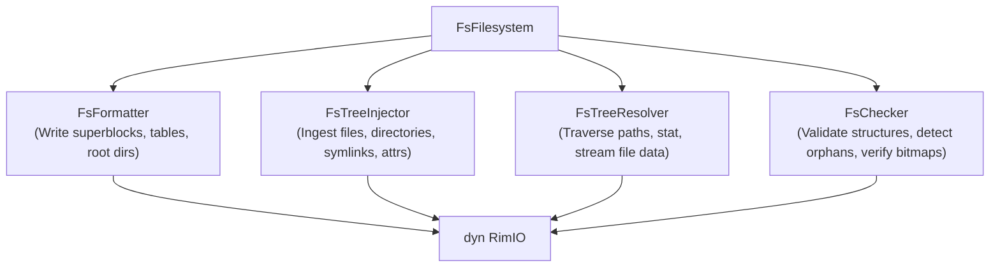
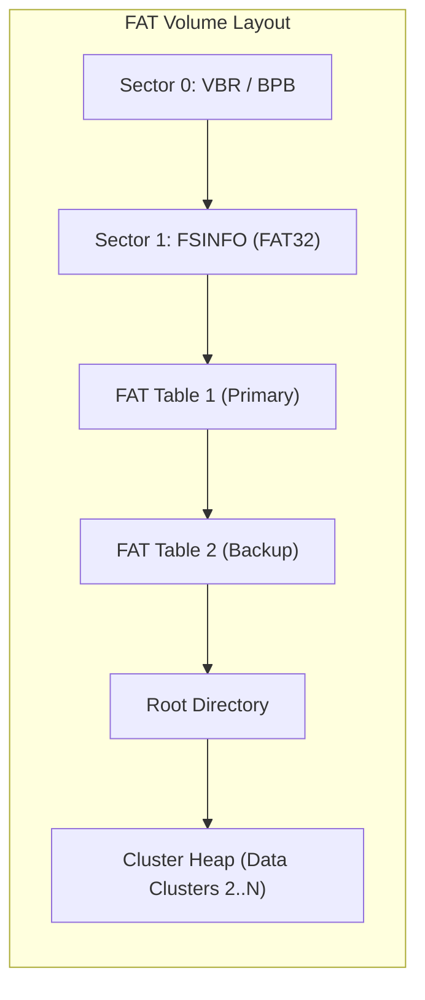
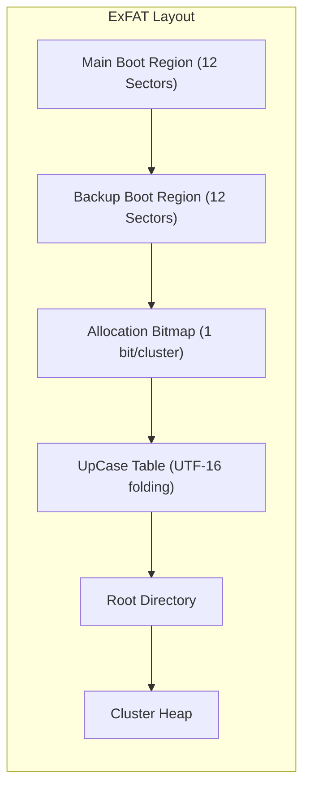
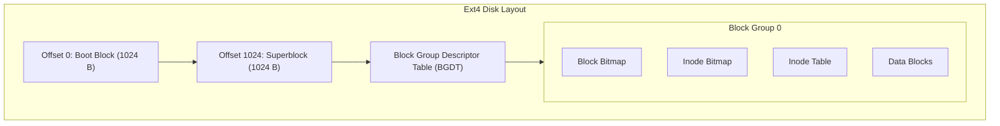
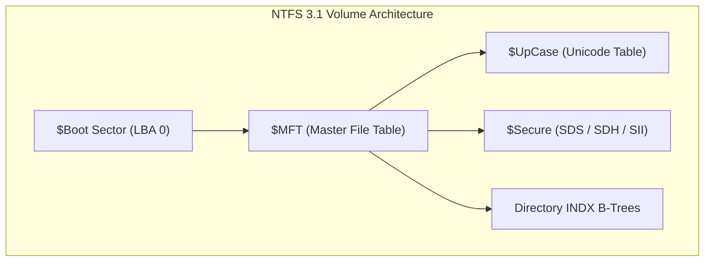
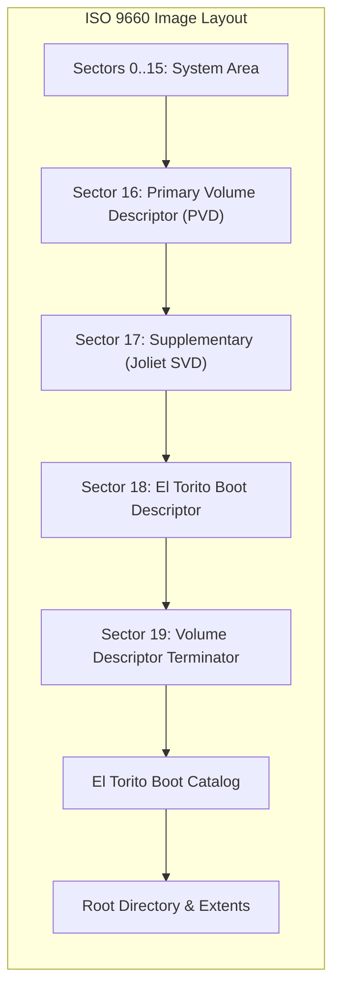
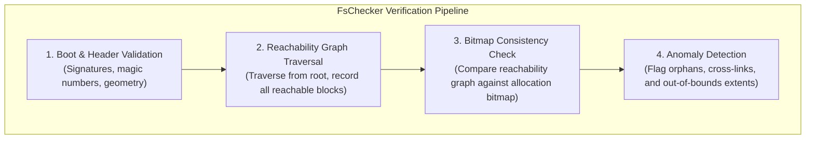

# Filesystem Engines & Contracts (`rimfs`)

This document provides the technical reference for the filesystem subsystem in RIM, detailing the abstraction contracts in [`rimfs-core`](../rimfs-core) and the internal implementations of the seven filesystem and archive engines.

---

## 1. Unified Filesystem Contracts (`rimfs-core`)

Every storage driver in RIM implements the unified trait contract [`FsFilesystem`](../rimfs-core/src/filesystem.rs), which decouples storage generation, injection, directory traversal, and verification from underlying I/O:

```rust
pub trait FsFilesystem<'a> {
    type Unit: Ord + Copy;
    type Meta: FsMeta<Self::Unit> + Clone + 'a;
    type Handle: FsHandle + Clone;
    type Formatter: FsFormatter + 'a;
    type Injector: FsTreeInjector<Self::Handle> + 'a;
    type Checker: FsChecker + 'a;
    type Resolver: FsTreeResolver + 'a;

    fn formatter(io: &'a mut (dyn RimIO + 'a), meta: &'a Self::Meta) -> Self::Formatter;
    fn injector(io: &'a mut (dyn RimIO + 'a), meta: &'a Self::Meta) -> FsInjectorResult<Self::Injector>;
    fn checker(io: &'a mut (dyn RimIO + 'a), meta: &'a Self::Meta) -> Self::Checker;
    fn resolver(io: &'a mut (dyn RimIO + 'a), meta: &'a Self::Meta) -> Self::Resolver;
    fn identifier() -> &'static str;
}
```



### Core Lifecycle Traits

1. **`FsFormatter`**:
   Responsible for formatting an uninitialized partition or stream. Computes cluster/block geometries, reserves metadata blocks (superblocks, allocation tables, bitmaps, root directories), and writes volume identifiers.
2. **`FsAllocator`**:
   Manages free allocation units (`Unit`: cluster number, block index, or inode ID). Allocates contiguous or fragmented extents and marks allocation bitmaps or FAT chains.
3. **`FsTreeInjector`**:
   Recursively writes files, directories, symlinks, POSIX permission bits, DOS attributes, and nanosecond timestamps into the target filesystem structure.
4. **`FsTreeResolver`**:
   Provides rootless read-only navigation. Resolves path segments (handling case sensitivity or insensitivity), reads node attributes, and streams file contents without mounting.
5. **`FsChecker`**:
   Performs deep structural validation. Verifies boot signatures, checks checksums, evaluates allocation bitmaps against actual reachability, and flags unreferenced orphan clusters or cross-linked files.

---

## 2. The Seven Filesystem Engines

RIM contains seven pure-Rust filesystem and archive drivers:

```
rimfs/
├── rimfs-fat    (FAT12, FAT16, FAT32 & RimFAT)
├── rimfs-exfat  (ExFAT with UpCase table & Allocation Bitmap)
├── rimfs-ext    (Ext2, Ext3, Ext4 with 48-bit Extents & BGDT)
├── rimfs-ntfs   (NTFS 3.1: $MFT, INDX B-trees, $Secure, Non-Resident Runs)
├── rimfs-iso    (ISO 9660 Level 1-3, Joliet UTF-16, Rock Ridge POSIX, El Torito)
├── rimfs-tar    (POSIX UStar streaming archive)
└── rimfs-zip    (PKWARE ZIP, ZIP64, Store & Deflate)
```

---

### 2.1 FAT Engine (`rimfs-fat`)

The `rimfs-fat` driver implements classic FAT filesystems along with RIM's high-integrity **RimFAT** extension:



#### Specifications & Technical Details
- **Variants Supported**: FAT12 (floppy/micro-embedded), FAT16 (small flash drives), FAT32 (universal standard), and RimFAT.
- **Directory Entries**:
  - **SFN (Short File Name)**: Standard 8.3 uppercase filename encoding (32 bytes per entry).
  - **LFN (Long File Name / VFAT)**: Sequence of 32-byte entries storing up to 13 UTF-16 code units each, bound to the target SFN entry via an 8-bit checksum.
- **Cluster Chain Traversal**:
  - EOF markers: `0x0FFF` (FAT12), `0xFFFF` (FAT16), `0x0FFFFFFF` (FAT32).
  - Bad cluster marking: `0x0FF7` (FAT12), `0xFFF7` (FAT16), `0x0FFFFFF7` (FAT32).
- **RimFAT Integrity Extension**:
  - Encodes 64-bit nanosecond timestamps and volume metadata checksums inside reserved sectors and unused BPB fields.
  - Fully backward-compatible: standard FAT readers access files normally, while RIM verifies volume integrity and prevents silent data corruption.

---

### 2.2 ExFAT Engine (`rimfs-exfat`)

The `rimfs-exfat` driver implements the modern Microsoft Extended File Allocation Table specification, optimized for large flash media (>32 GiB).



#### Specifications & Technical Details
- **Boot Regions**:
  - Main Boot Region: 12 sectors consisting of 1 Boot Sector, 8 Extended Boot Sectors, 1 OEM Parameter Sector, 1 Reserved Sector, and 1 Boot Checksum Sector.
  - Backup Boot Region: Exact duplicate of the 12 sectors located immediately after the Main Region.
  - Boot Checksum: Real-time verification over all 11 preceding sectors using a 32-bit rotational sum.
- **Allocation Bitmap**:
  - 1 bit per cluster (0 = free, 1 = allocated), eliminating the need for FAT table traversal for contiguous allocations.
- **UpCase Table**:
  - Pre-compiled Unicode uppercase mapping table supporting run-length compression for case-insensitive path lookups.
- **Directory Entry Sets**:
  Files are represented by consecutive sets of 32-byte directory records:
  1. **File Directory Entry (`0x85`)**: File attributes, creation/modification timestamps.
  2. **Stream Extension Entry (`0xC0`)**: Allocation flags (`NoFatChain` for contiguous files), `FirstCluster`, `ValidDataLength`, and total `DataLength`.
  3. **File Name Entries (`0xC1`)**: 1 to 17 entries containing up to 15 UTF-16 characters each (supporting paths up to 255 characters).

---

### 2.3 EXT Engine (`rimfs-ext`)

The `rimfs-ext` driver supports Linux native Ext2, Ext3, and Ext4 filesystems with modern feature flags.



#### Specifications & Technical Details
- **Superblock & Group Descriptors**:
  - Superblock located at byte offset 1024.
  - Block Group Descriptor Table (BGDT): Supports 32-byte legacy descriptors (Ext2/3) and 64-byte descriptors (`EXT4_FEATURE_INCOMPAT_64BIT`) supporting volumes up to 1 EiB.
- **Inodes**:
  - Standard 256-byte inodes (`EXT4_FEATURE_RO_COMPAT_EXTRA_ISIZE`) supporting nanosecond timestamps and extended attribute storage.
  - 32-bit UID/GID (`EXT4_FEATURE_RO_COMPAT_GDT_CSUM`).
- **Extent Trees (`EXT4_FEATURE_INCOMPAT_EXTENTS`)**:
  - Replaces traditional indirect block pointers with a high-performance B-tree.
  - Inode contains an `ext4_extent_header` followed by up to 4 `ext4_extent` (leaf) or `ext4_extent_idx` (internal branch) entries.
  - Leaf extents map contiguous logical blocks to physical 48-bit block numbers (up to 32,768 contiguous blocks per extent record).
- **Symlink Optimization**:
  - **Fast Symlinks**: Targets $\le 60$ bytes are stored inline directly inside the inode's block pointer array (`i_block`), requiring zero data block allocations.
  - **Slow Symlinks**: Targets $> 60$ bytes are allocated into regular data extents.

---

### 2.4 NTFS Engine (`rimfs-ntfs`)

The `rimfs-ntfs` driver provides a pure-Rust, userspace implementation of NTFS 3.1 without kernel drivers or external tools.



#### Specifications & Technical Details
- **USA (Update Sequence Array / Fixup)**:
  - Protects against torn writes. The last 2 bytes of each 512-byte sector in an MFT record (1024 bytes) or Index Block (4096 bytes) are swapped into the USA array and replaced with a sequence number.
- **MFT Record Structure (1024 bytes)**:
  - Header: Signature `FILE`, USA offset/count, Log Sequence Number (LSN), sequence number, hard link count, first attribute offset, flags (`IN_USE`, `DIRECTORY`).
- **Standard Attribute Pipeline**:
  - `$STANDARD_INFORMATION` (`0x10`): Basic file flags, 100-ns Windows NT timestamps, security ID.
  - `$FILE_NAME` (`0x30`): Parent directory MFT record index, UTF-16 filename, namespace flags (POSIX, Win32, DOS, Win32 & DOS).
  - `$DATA` (`0x80`):
    - **Resident**: Small file payloads stored directly inside the MFT record.
    - **Non-Resident**: Described by variable-length byte-compressed *data runs* mapping logical cluster numbers (VCN) to physical clusters (LCN).
- **B-Tree Directory Indexing**:
  - Small directories use `$INDEX_ROOT` (`0x90`) resident entries.
  - Large directories allocate external `$INDEX_ALLOCATION` (`0xA0`) records structured as balanced B-trees using `$BITMAP` (`0xB0`) for index record allocation.
- **Security Descriptors (`$Secure`)**:
  - Pure-Rust implementation of Windows Security Descriptors:
    - `$SDS`: Data stream containing raw `SECURITY_DESCRIPTOR` buffers with owner SID, group SID, DACL, and SACL.
    - `$SDH`: Hash B-tree index indexing descriptors by security hash.
    - `$SII`: Security ID index mapping 32-bit security IDs to SDS stream offsets.

---

### 2.5 ISO 9660 Engine (`rimfs-iso`)

The `rimfs-iso` driver generates and parses optical disk images complying with ECMA-119 and modern hybrid booting standards.



#### Specifications & Technical Details
- **Sector Size**: Fixed 2048-byte sector geometry.
- **Joliet Extension**:
  - Supplementary Volume Descriptor (SVD, type 2) with escape sequences `UCS-2 Level 3` (`%/@`, `%/C`, `%/E`).
  - Stores directory trees with UTF-16 Big-Endian Unicode filenames up to 64 characters long and deep path hierarchies.
- **Rock Ridge Extension (SUSP)**:
  - System Use Sharing Protocol (SUSP) records inside the System Use Area of directory entries.
  - `RR` / `PX`: POSIX mode (permissions, file type), UID, GID, link count.
  - `NM`: Long POSIX filenames without character set restrictions.
  - `SL`: Symbolic link path targets.
- **El Torito Boot Specification**:
  - Enables hybrid optical booting.
  - Initial/Default Boot Entry pointing to UEFI boot images (`bootx64.efi` inside an embedded FAT image) and legacy BIOS boot loaders.

---

### 2.6 TAR Engine (`rimfs-tar`)

The `rimfs-tar` driver implements the POSIX UStar streaming archive specification (`no_std + alloc` compatible):

- **Header Structure (512 bytes)**:
  - `name` (100 B), `mode` (8 B octal), `uid` (8 B octal), `gid` (8 B octal), `size` (12 B octal), `mtime` (12 B octal), `chksum` (8 B octal), `typeflag` (1 B), `linkname` (100 B), `magic` (`"ustar\0"` 6 B), `version` (2 B), `uname` (32 B), `gname` (32 B), `prefix` (155 B).
- **Framing & Padding**:
  - Files are aligned to 512-byte block boundaries.
  - Archive termination is marked by two consecutive 512-byte zero-filled blocks.

---

### 2.7 ZIP Engine (`rimfs-zip`)

The `rimfs-zip` driver provides streaming ZIP and ZIP64 creation and extraction:

- **Local File Header (LFH, 30 bytes)**: Signature `0x04034b50`, compression method, CRC-32, compressed/uncompressed sizes, filename length, extra field length.
- **Central Directory Header (CDH, 46 bytes)**: Signature `0x02014b50`, external file attributes (POSIX permissions in upper 16 bits), relative offset of local header.
- **End of Central Directory (EOCD, 22 bytes)**: Signature `0x06054b50`, number of central directory entries, size and offset of central directory.
- **ZIP64 Architecture**:
  - Automatically activates when archive size exceeds 4 GiB or file count exceeds 65,535.
  - Emits ZIP64 End of Central Directory Record (56 bytes, `0x06064b50`) and ZIP64 Locator (20 bytes, `0x07064b50`).
- **Compression Modes**:
  - **Store (Method 0)**: Zero compression, `#![no_std]` compatible.
  - **Deflate (Method 8)**: Standard RFC 1951 streaming compression.

---

## 3. Consistency Verification (`FsChecker`)

Every filesystem driver includes an implementation of [`FsChecker`](../rimfs-core/src/checker/mod.rs) to ensure structural integrity without mounting:



- **`ReachabilityTracker`**:
  Tracks all referenced clusters/blocks during recursive directory traversal.
- **Orphan Detection**:
  Identifies blocks marked as allocated in the filesystem bitmap or FAT chain that are not reachable from any directory entry.
- **Cross-Link Detection**:
  Detects when two distinct files or directories reference overlapping clusters or block extents.
