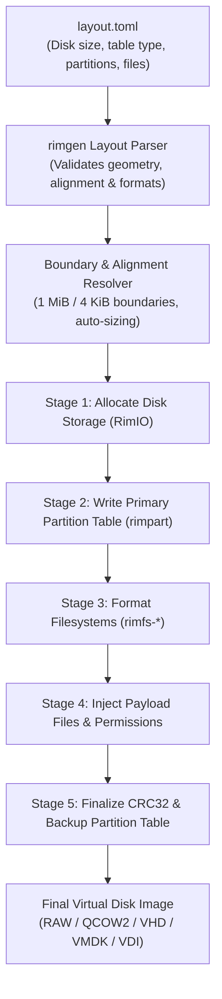
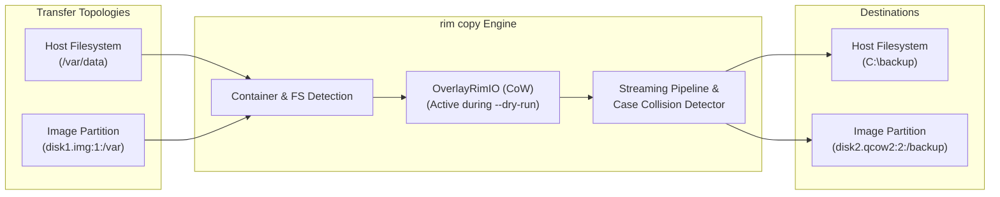
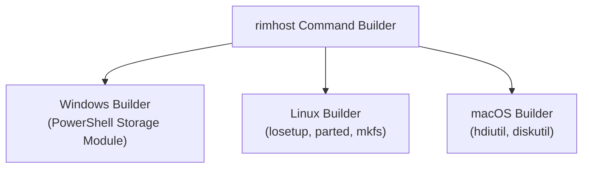

# Storage Synthesis & Transfer Engine (`rimgen`, `rimcli`, `rimhost`)

This document details the high-level orchestration components of RIM: the declarative synthesis engine ([`rimgen`](../rimgen)), the universal rootless transfer engine (`rim copy` in [`rimcli`](../rimcli)), and the host operating system integration layer ([`rimhost`](../rimhost)).

---

## 1. Declarative Storage Synthesis (`rimgen`)

[`rimgen`](../rimgen) is a library-first storage layout synthesis engine that transforms declarative TOML configuration files into complete, bootable virtual disks or physical media images.



### 1.1 The `layout.toml` Specification

The declarative schema defines disk geometry, partition layouts, filesystems, and payload injection mappings:

```toml
[disk]
size = "2G"             # Supports units: B, K, M, G, T, or auto
table = "gpt"           # Partition table: 'gpt' or 'mbr'
alignment = "1M"        # Default partition alignment: 1M (1,048,576 bytes)

[[partitions]]
name = "ESP"
fs = "fat32"            # fat12, fat16, fat32, exfat, ext2, ext3, ext4, ntfs, iso9660
size = "256M"
bootable = true

[partitions.files]
"/EFI/BOOT/BOOTX64.EFI" = "target/x86_64-unknown-uefi/release/boot.efi"
"/loader/entries.conf"  = "config/entries.conf"

[[partitions]]
name = "rootfs"
fs = "ext4"
size = "auto"           # Automatically calculated from injected payloads + overhead

[partitions.files]
"/" = "build/rootfs_tree/"
```

### 1.2 Layout Resolution Algorithms

During the parsing phase, `rimgen` performs mathematical validation on the partition layout:

1. **Alignment Enforcement**:
   Partitions are aligned to configurable block boundaries (default: `1 MiB` = $2,048$ sectors of 512 bytes). This eliminates misaligned I/O performance penalties on physical SSDs, NVMe drives, and virtual hypervisors.
2. **Dynamic `size = "auto"` Calculation**:
   When a partition specifies `size = "auto"`, `rimgen`:
   - Walks the host source directories to compute total file payload size.
   - Computes filesystem metadata overhead:
     - **FAT32**: Reserved sectors, FAT1/FAT2 tables, root cluster.
     - **Ext4**: Superblock copies, Block Group Descriptor Tables (BGDT), inode allocation tables, and journal reservation.
     - **NTFS**: `$MFT` initial reservation (typically 12.5% of volume), `$LogFile`, `$Bitmap`, and directory B-trees.
   - Rounds up the computed size to the next partition alignment boundary.
3. **Collision Detection**:
   Ensures that partition ranges never overlap and that the final partition does not exceed the designated disk capacity or collide with the secondary GPT array at `LBA END-33`.

### 1.3 The Multi-Stage Build Pipeline

Synthesis is executed by [`rimgen::build_on_io`](../rimgen/src/builder/mod.rs) using zero-allocation sub-slicing:

- **Step 1: Partition Table Initialization**:
  Emits the Protective MBR and Primary GPT Header (or standard MBR).
- **Step 2: Partition Slicing**:
  For each partition, a [`BoundedRimIO`](../rimio/src/mem.rs) view is constructed covering exactly the partition's allocated sector range $[LBA_{start}, LBA_{end}]$.
- **Step 3: In-Place Formatting**:
  The appropriate `FsFormatter` formats the filesystem directly into the bounded view.
- **Step 4: Tree Injection**:
  The `FsTreeInjector` ingests host files and directory trees into the partition.
- **Step 5: Integrity Finalization**:
  Calculates partition entry array CRC32 checksums, updates the Primary GPT Header, and writes the Secondary Backup GPT at the end of the disk.

---

## 2. Rootless Logical Transfer Engine (`rim copy`)

The `rim copy` engine in [`rimcli`](../rimcli) provides universal, rootless logical transfers between host filesystems and disk image partitions (or between two disk images) without kernel drivers or mounting.



### 2.1 Universal Path Addressing

`rim copy` introduces strict, deterministic 1-based partition syntax:

```bash
# Copy from host to partition 1 of a raw disk image
rim copy ./payload.bin disk.img:1:/boot/payload.bin

# Copy from partition 2 of a QCOW2 image to local host directory
rim copy disk.qcow2:2:/etc/nginx/nginx.conf ./nginx.conf

# Cross-image transfer between two different filesystem types (e.g. EXT4 -> NTFS)
rim copy linux.img:2:/data/file.db windows.vhd:1:/data/file.db
```

### 2.2 In-Memory Simulation (`--dry-run`)

When `--dry-run` is specified, `rim copy` wraps the destination partition in an [`OverlayRimIO`](../rimio/src/sparse.rs):
- All metadata lookups, directory allocations, cluster reservations, and inode modifications are executed in ephemeral in-memory sparse pages.
- Validates that sufficient free space exists, verifies path traversals, and reports exact allocation metrics.
- Discards the overlay upon completion, guaranteeing that **zero bytes are written to the target disk image**.

### 2.3 Cross-Filesystem Semantic Translation

Different filesystems enforce incompatible metadata models. `rim copy` bridges these semantics automatically:

| Semantic Attribute | Source: EXT2/3/4 | Target: FAT / ExFAT | Target: NTFS 3.1 |
|---|---|---|---|
| **Case Sensitivity** | Case-sensitive (`File.txt` $\neq$ `file.txt`) | Case-preserving, case-insensitive | Case-preserving, case-insensitive |
| **Collision Handling** | Allowed | Collision Error flagged | Collision Error flagged |
| **Permissions** | Full POSIX mode (rwxr-xr-x) | Read-Only attribute mapping | Windows Security Descriptor (DACL) |
| **Timestamps** | Nanosecond atime/mtime/ctime | 10-ms (FAT32) / 10-ms (ExFAT) | 100-ns FILETIME |
| **Symlinks** | POSIX symlink (fast/slow) | Materialized / copied or skipped | Reparse point / Symbolic link |

---

## 3. Host System Interoperability (`rimhost`)

While RIM operates 100% rootless in userspace by default, [`rimhost`](../rimhost) provides native command generation when host-native mounting or OS-level device integration is explicitly requested.



- **Windows (`rimhost::windows`)**:
  Generates idempotent PowerShell scripts utilizing the `Storage` and `Hyper-V` modules:
  - `New-VHD`, `Mount-VHD`, `Initialize-Disk`, `New-Partition`, `Format-Volume`.
- **Linux (`rimhost::linux`)**:
  Generates POSIX shell sequences for loopback device setup:
  - `losetup -Pf --show <image>`, `parted -s`, `mkfs.ext4`, `mount -o loop`.
- **macOS (`rimhost::macos`)**:
  Generates macOS disk management sequences:
  - `hdiutil attach -nomount`, `diskutil partitionDisk`, `newfs_msdos`, `hdiutil detach`.
