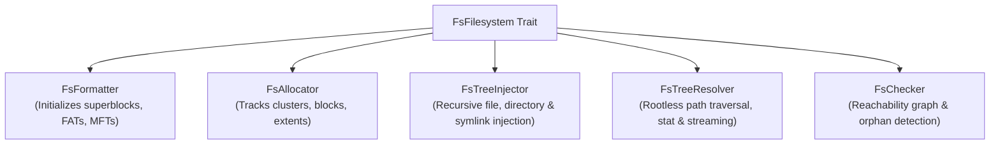

# rimfs-core

[](https://crates.io/crates/rimfs-core)
[](https://docs.rs/rimfs-core)
[](../LICENSE)
[](#cargo-features)

**`rimfs-core`** provides the shared foundational traits, metadata structures, and verification abstractions of the **[RIM](../README.md)** filesystem ecosystem (Layer 2).

It establishes the unified contract implemented by all seven filesystem and archive engines in RIM.

---

## Architecture & System Role

`rimfs-core` standardizes filesystem interactions into five composable lifecycle traits:



### Implementing Drivers:
- **`rimfs-fat`**: FAT12, FAT16, FAT32, and the 64-bit RimFAT integrity extension.
- **`rimfs-exfat`**: ExFAT with Allocation Bitmap and UpCase table.
- **`rimfs-ext`**: Ext2, Ext3, and Ext4 with 48-bit physical extent trees and BGDT.
- **`rimfs-ntfs`**: Pure-Rust NTFS 3.1 with MFT, INDX B-trees, and `$Secure`.
- **`rimfs-iso`**: ISO 9660 Level 1-3, Joliet (UTF-16), Rock Ridge (POSIX), and El Torito.
- **`rimfs-tar`**: POSIX UStar streaming archive driver.
- **`rimfs-zip`**: PKWARE ZIP and ZIP64 streaming archive driver.

For exhaustive contract definitions and lifecycle diagrams, see **[Filesystem Engines & Contracts](../docs/FILESYSTEMS.md)** and the **[Architecture Overview](../docs/ARCHITECTURE.md)**.

---

## Installation

```bash
cargo add rimfs-core
```

For constrained `no_std` environments:

```bash
cargo add rimfs-core --no-default-features --features alloc
```

---

## Key Abstractions

### 1. The `FsFilesystem` Contract

```rust
pub trait FsFilesystem<'a> {
    type Unit: Ord + Copy;
    type Meta: FsMeta<Self::Unit> + Clone + 'a;
    type Handle: FsHandle + Clone;
    type Formatter: FsFormatter + 'a;
    type Injector: FsTreeInjector<Self::Handle> + 'a;
    type Checker: FsChecker + 'a;
    type Resolver: FsTreeResolver + 'a;

    fn formatter(io: &'a mut (dyn RimIO + 'a), meta: &'a Self::Meta) -> Self::Formatter;
    fn injector(io: &'a mut (dyn RimIO + 'a), meta: &'a Self::Meta) -> FsInjectorResult<Self::Injector>;
    fn checker(io: &'a mut (dyn RimIO + 'a), meta: &'a Self::Meta) -> Self::Checker;
    fn resolver(io: &'a mut (dyn RimIO + 'a), meta: &'a Self::Meta) -> Self::Resolver;
    fn identifier() -> &'static str;
}
```

### 2. Node Representation & Attributes (`FsNode`, `FileAttributes`)

Files and directories are modeled as self-describing tree nodes independent of host OS file descriptors:

```rust
use rimfs_core::resolver::attr::FileAttributes;
use rimfs_core::resolver::node::FsNode;

// Create a file node with POSIX permissions and timestamps
let mut attr = FileAttributes::new_file();
attr.mode = Some(0o100644);
attr.uid = Some(1000);
attr.gid = Some(1000);

let file_node = FsNode::new_file("config.toml", b"[rim]\nenabled = true\n".to_vec());
```

### 3. Reachability & Integrity Framework (`ReachabilityTracker`)

`rimfs-core` includes a dedicated verification engine for offline filesystem validation:
- **`ReachabilityTracker`**: Records every cluster or block visited during directory tree traversal.
- **Bitmap Discrepancy Detection**: Compares reachable allocations against on-disk allocation bitmaps or FAT chains, pinpointing leaked blocks, cross-linked files, and orphan clusters without mounting.

---

## Cargo Features

- **`std`** (default): Enables standard library integrations and host filesystem resolution (`StdResolver`).
- **`alloc`**: Enables heap-based node graphs (`FsNode`), error allocations, and string formatting.
- **`mem`**: Enables in-memory buffer utilities.
- **`uefi`**: Enables bare-metal UEFI pre-boot integrations.

---

## Related Documentation

- **[Filesystem Engines & Contracts](../docs/FILESYSTEMS.md)**
- **[Architecture Overview](../docs/ARCHITECTURE.md)**
- **[Workspace Overview](../README.md)**
